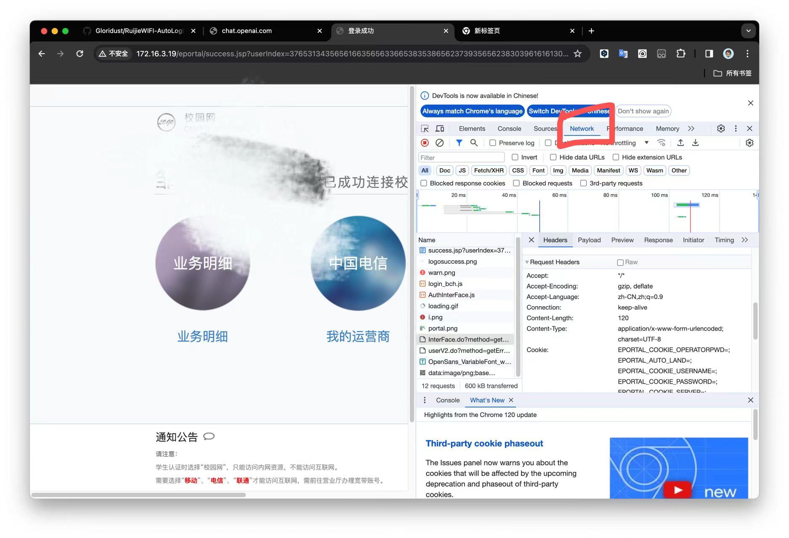
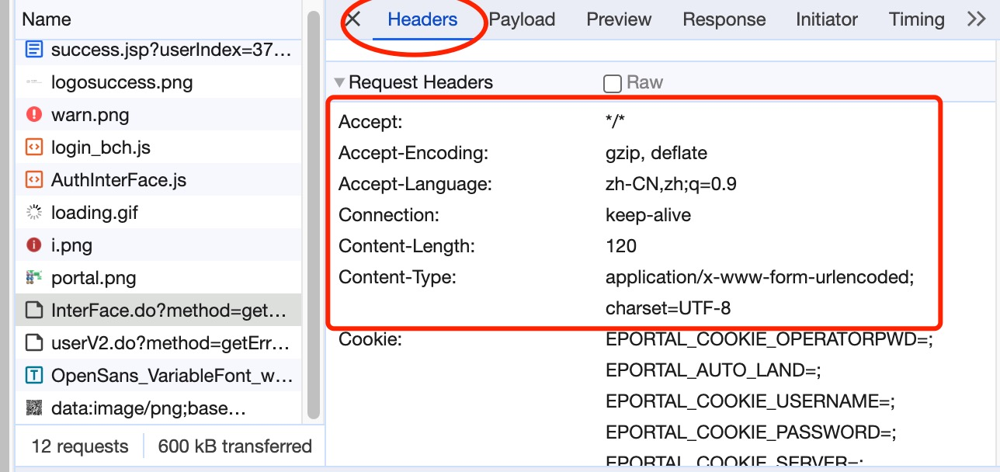
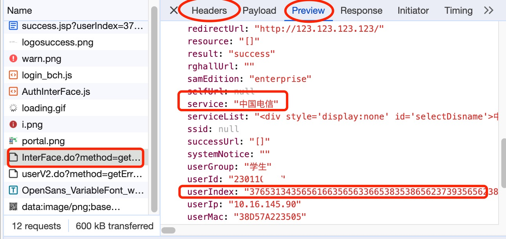
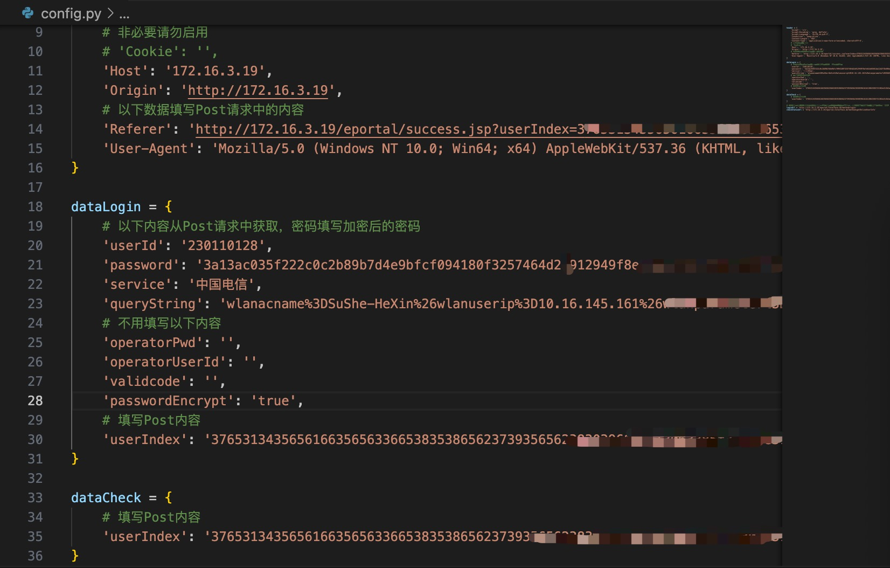
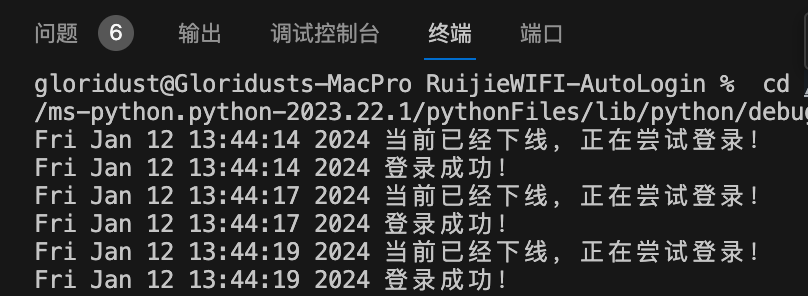
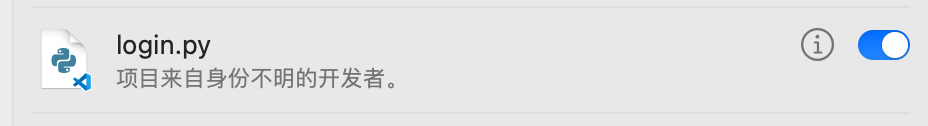

# RuijieWIFI-AutoLogin
宜宾学院自动登录锐捷校园WiFi认证系统，防止意外掉线。理论上支持所有锐捷系统。


  


## 开始

1. 将代码下载或 clone 到本地

```bash
git clone https://github.com/Gloridust/RuijieWIFI-AutoLogin.git
```

2. 将 `example.config.py` 重命名为 `config.py`，即可开始填写配置文件。

## 配置

1. 打开浏览器，访问学校校园网登录界面。按 `F12` 以打开开发者工具。选择 `Network` 选项卡。



2. 刷新页面，输入账号密码、选择运营商后登录。注意：必须重新填写密码，请勿使用记住密码的密码内容。在开发者工具中，你可以尝试找到一些文件，里面可能有我们需要的数据。以下图片可供参考，你可能在这些位置找到这些配置信息：





3. 打开项目文件中的 `config.py` 配置文件，按照提示，对照浏览器开发者工具中的信息填写内容。如果你未找到加密后的密码或 password 值为 null，则直接填写明文密码并将'passwordEncrypt'改为'false',并确保其他内容填写完整。以下是我的配置信息，仅供参考：



更正：`service`的数据可能出错，例如：`中国电信`请填`dianxin`

## 运行

如果一切顺利，你已经可以运行它了：

```bash
python3 ./login.py
```



尝试网上冲浪吧！如果再次打开登录页面仍然是输入密码界面，不妨刷新一下。

## 进阶操作

### 开机自启

将自动化落实到底，体验家用宽带一般的快感，无感登录。

#### macOS

1. 在`login.py`主程序目录中给权限：

```bash
chmod +x login.py
```

2. 将项目目录下的`example.net.innovisle.RuijieWIFI-AutoLogin.plist`重命名为`net.innovisle.RuijieWIFI-AutoLogin.plist`
3. 编辑`net.innovisle.RuijieWIFI-AutoLogin.plist`，将`AutoLogin`的绝对路径填入。
4. 编辑`AutoLogin`，将`login.py`的绝对路径填入。
5. 将创建的 `net.innovisle.RuijieWIFI-AutoLogin.plist` 文件放置在 `~/Library/LaunchAgents` 目录下。
6. 加载 plist 文件：尝试以下命令中的任意一条：

```bash
launchctl load ~/Library/LaunchAgents/net.innovisle.RuijieWIFI-AutoLogin.plist
```

```bash
launchctl bootstrap gui/$(id -u) ~/Library/LaunchAgents/net.innovisle.RuijieWIFI-AutoLogin.plist
```

如果没有报错，那么你会收到登录项的通知，并在登陆项列表中看见它：



#### Windows

将脚本或其快捷方式放入 Windows 的“启动”文件夹。

按 Windows+R 打开“运行”对话框，输入 shell:startup，然后按 Enter。这会打开“启动”文件夹。

将你的 Python 脚本或其快捷方式放入此文件夹。如果是快捷方式，确保它指向了正确的脚本路径和 Python 解释器。

### 自动登录频率

在`login.py`的最后一行代码可以调整登录频率，默认每 1-3 秒登录一次。你可以适当调整。比如你希望每 5-10 秒尝试一次登录，你可以修改为：

```python
time.sleep(random.randint(5, 10))
```

## LICENSE

MIT